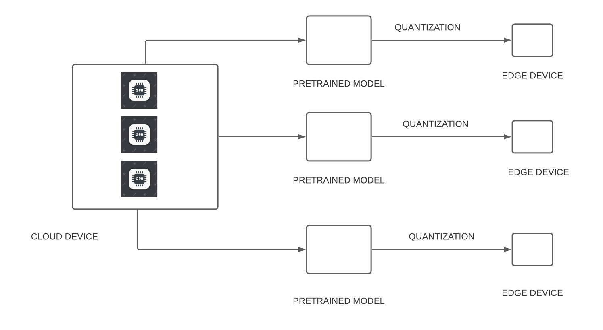

## Edge-Device NMT

Edge-Device based Machine Learning Inference for Computational Accuracy and Model Efficiency.  

The NMT model is a Sequence To Sequence (SeqtoSeq) model with attention following the official
[pytorch tutorial](https://pytorch.org/tutorials/intermediate/seq2seq_translation_tutorial.html)  

The project proposed here is to [quantize](https://pytorch.org/docs/stable/quantization.html) pretrained NMT models for deployment on edge-devices.  

